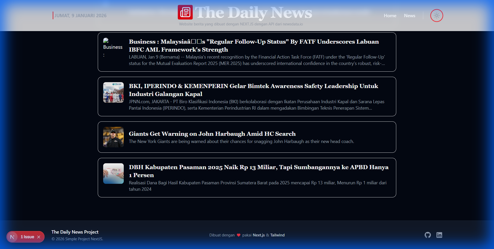

# The Daily News


A modern, responsive news portal built with **Next.js 15+**, **Tailwind CSS v4**, and **TypeScript**. Focuses on a clean reading experience, dark mode support, and seamless performance.

## 🚀 Features

- **Modern Tech Stack**: Built on the bleeding edge with Next.js App Router and Tailwind CSS v4.
- **Dark Mode Support**: Fully integrated dark mode with smooth transitions and specific contrast optimizations.
- **Responsive Design**: Crafted to look great on mobile, tablet, and desktop screens.
- **Interactive UI**: Glassmorphism headers, subtle hover effects, and skeleton loading states.
- **Clean Typography**: Uses _Inter_ for UI and _Playfair Display_ for headlines to mimic a premium editorial feel.

## 🛠️ Tech Stack

- **Framework**: [Next.js 15](https://nextjs.org/) (App Router)
- **Styling**: [Tailwind CSS v4](https://tailwindcss.com/)
- **Language**: TypeScript
- **Icons**: [Lucide React](https://lucide.dev/), [React Icons](https://react-icons.github.io/react-icons/)
- **Fonts**: Inter & Playfair Display (via `next/font`)

## 📸 Screenshots

### Dark Mode (Optimized)


_Featuring corrected text contrast and background consistency._

### Light Mode


_Clean, minimal, and paper-like aesthetic._

### Footer Design


_Fully themed footer with social links._

## 📂 Project Structure

```bash
news-project/
├── app/
│   ├── api/             # Backend API routes for news data
│   ├── components/      # Reusable UI components (Header, Footer, News Cards)
│   ├── globals.css      # Global styles & Dark mode overrides
│   ├── layout.tsx       # Root layout & Providers
│   └── page.tsx         # Main entry point (Featured News)
├── public/              # Static assets
└── docs/                # Documentation & Screenshots
```

## ⚙️ Getting Started

1.  **Clone the repository**

    ```bash
    git clone https://github.com/yourusername/news-project.git
    cd news-project
    ```

2.  **Install dependencies**

    ```bash
    npm install
    ```

3.  **Run the development server**

    ```bash
    npm run dev
    ```

4.  **Open locally**
    Visit [http://localhost:3000](http://localhost:3000) to see the app.

## 🔌 API & Environment Setup

This project uses **[NewsData.io](https://newsdata.io/)** to fetch the latest news. You will need an API key to run the project successfully.

### 1. Get an API Key

- Go to [NewsData.io](https://newsdata.io/) and create an account.
- Navigate to your dashboard to find your **API Key**.

### 2. Configure Environment Variables

- Create a file named `.env` in the root directory (based on `.env.example`).
- Add your API key:
  ```env
  NEWSIO_APIKEY=your_actual_api_key_here
  ```

### 3. Fetching Logic (`app/api/news_data.tsx`)

- **Server-Side Fetching**: News data is fetched on the server using `fetch()`.
- **Caching**: Requests are cached for **5 minutes** (`revalidate: 300`) to optimize performance and save API credits.
- **Sanitization**: Helper functions automatically upgrade URLs to `https://` and filter out missing images.

## 🎨 Customization Highlights

### Dark Mode Overrides

Since Tailwind v4 is relatively new, this project uses specific **CSS strategy overrides** in `globals.css` to ensure robust dark mode rendering for text and backgrounds, solving common variant specificity issues.

```css
/* Example from globals.css */
html.dark footer {
  background-color: #111827 !important;
  border-color: #1f2937 !important;
}
```

## 👥 Credits

**Developer**: Adika Brahmana Rafi Sejati  
**Role**: SoftSpoken Developer

---

_Created with Next.js and ❤️_
